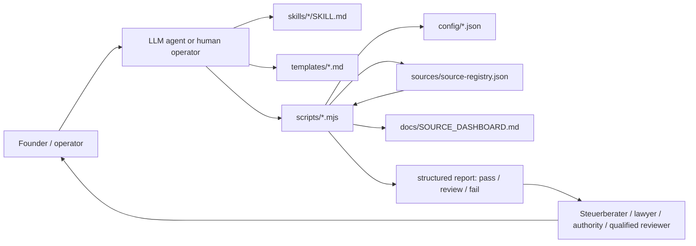
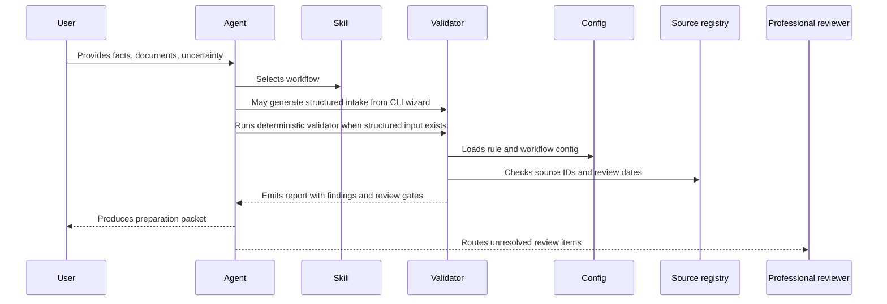
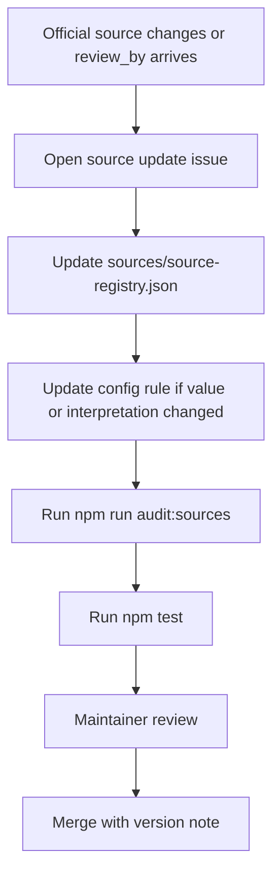

# Architecture

Berlin-Tax is a procedural knowledge layer for AI agents and founder operators. It separates judgment, source metadata, deterministic checks, and human review.

As of `0.1.x`, the public beta-candidate surface is GitHub plus CLI:

- guided intake generation through `scripts/create-intake.mjs`
- source freshness visibility through `scripts/generate-source-dashboard.mjs`
- one founder golden path through `scripts/run-golden-path.mjs`
- beta-safe deterministic reports that surface trust boundaries first

## Core Boundary

Agents may interpret context, ask follow-up questions, assemble packets, and explain uncertainty. Scripts validate structured inputs and source freshness. Humans and qualified professionals make case-specific legal, tax, employment, immigration, company-law, and filing decisions.

## Data Flow

## Repository Layers

| Layer | Path | Owns | Must not do |
| --- | --- | --- | --- |
| Skills | `skills/` | Procedural workflow instructions | Hardcode thresholds or case-specific legal determinations |
| Config | `config/` | Machine-readable thresholds, field lists, workflow gates, output contracts | Hide professional judgment in opaque rules |
| Sources | `sources/` | Official-source registry and review metadata | Use non-official sources for deterministic legal values |
| Scripts | `scripts/` | Deterministic validation and report generation | Submit filings or decide legal/tax status |
| Templates | `templates/` | Output shapes and evidence discipline | Present generated text as submission-ready |
| Examples | `examples/` | Fictional fixtures and stress cases | Pretend to be model answers for real users |
| Docs | `docs/` | Maintainer process, source governance, versioning | Duplicate active rules from config |

## Trust Boundaries

Berlin-Tax does not submit filings, classify legal status, certify invoices, or decide tax treatment. It prepares the user for those actions.

Risk-heavy workflows must route to review when they involve:

- Gewerbe vs freiberuflich classification.
- Kleinunternehmer eligibility, threshold crossing, or opt-out decisions.
- VAT registration, VAT ID, reverse charge, OSS, imports, exports, or filing frequency.
- ALG I, Buergergeld, employment, side-business, or availability rules.
- Residence permit, visa, or work authorization constraints.
- UG/GmbH formation, notary, shareholder, payroll, or managing-director issues.
- Retroactive corrections, missed deadlines, penalties, estimates, or authority notices.
- Regulated sectors such as food, alcohol, health, transport, finance, security, childcare, craft trades, or POS/cash-heavy retail.

## Source Lifecycle

Every rule pack value has an owner-facing lifecycle:

- `source_id`: registry key in `sources/source-registry.json`.
- `last_verified`: date a contributor checked the cited source.
- `review_by`: date after which the value must be treated as stale.
- `risk_level`: operational impact if the value is wrong.
- `verification_checkpoint`: blocking instruction surfaced in reports.

The default posture is conservative. A stale source should create a failure or review gate, not silent confidence.

## Script Design

Scripts follow the same pattern:

1. Parse one structured input file.
2. Load config through `scripts/lib/config.mjs`.
3. Never hardcode legal thresholds already represented in `config/`.
4. Emit the shared report shape from `createReport`.
5. Use `pass`, `review`, or `fail`.
6. Preserve source IDs and verification checkpoints.

Current script groups:

- Source and repository audits: `audit-sources.mjs`, `self-audit.mjs`, `validate-skill.mjs`.
- Founder CLI helpers: `create-intake.mjs`, `run-golden-path.mjs`.
- Source visibility tooling: `generate-source-dashboard.mjs`.
- Domain validators: `validate-invoice.mjs`, `check-thresholds.mjs`, `generate-compliance-calendar.mjs`.
- Workflow validators: `validate-workflow.mjs`.

## Report Contract

All deterministic reports now start with the same trust boundary:

- `boundary_notice`
- `assumptions`
- `user_provided_inputs`
- `verified_facts`
- `verified_source_references`
- `professional_review_required`
- `professional_review_items`
- `verification_before_submission`
- `open_verification_items`
- `verification_checkpoints`

This is deliberate. The report should make it difficult for a user or agent to skip straight to the status and pretend the output is submission-ready.

## Beta Surface

The current founder-facing path is intentionally narrow:

1. Generate or inspect intake JSON.
2. Run deterministic checks.
3. Read the golden-path packets or user guide.
4. Escalate unresolved items with a cleaner packet.

The repository is still preparation-only. It does not provide a browser app, ELSTER submission, invoice certification, or live source freshness checks.

## Configuration Strategy

Use config files for values or branches that contributors need to inspect without reading script internals:

- `config/rules.de.berlin.json`: source-backed tax, invoice, calendar, and Berlin workflow candidates.
- `config/workflow-rules.json`: required fields and review-routing gates for operational workflows.
- `config/output-standard.json`: shared output contract and allowed status/finding levels.

Do not duplicate active rule values in docs. Docs may explain where a value lives and how to verify it, but the script should read from config.

## Agent Compatibility

Skills are plain directories with `SKILL.md`, optional references, and examples. They are readable by file-oriented coding agents and by maintainers reviewing changes in GitHub.

Expected agent pattern:

1. Read the relevant skill.
2. Load only the referenced material needed for the case.
3. Ask for missing user inputs.
4. Run deterministic scripts where structured validation is available.
5. Produce output using shared templates.
6. Clearly label uncertainty, review items, and evidence gaps.

## Maintainer Rule

When a change touches legal/tax wording, source IDs, config values, or validator branching, reviewers should ask: "What would happen if a stressed founder copied this output into a real filing, invoice, or authority email?"
